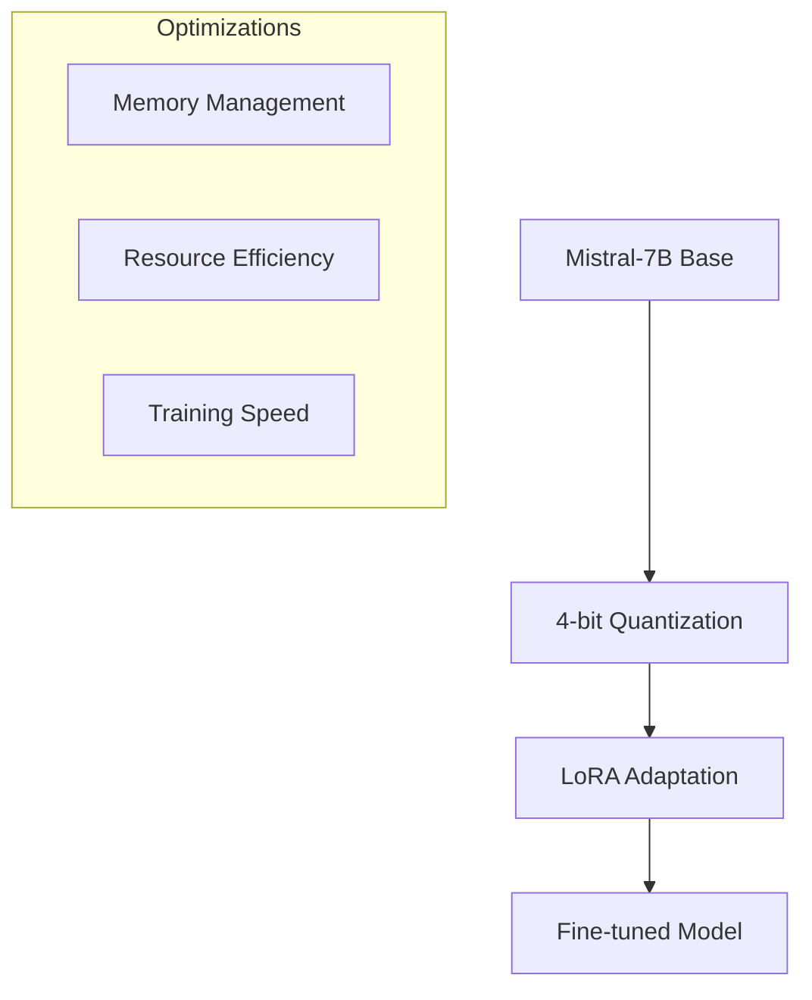

# StudyAbroadGPT: Fine-tuned LLM for Study Abroad Assistance

## Overview
StudyAbroadGPT is a specialized language model based on Mistral-7B, fine-tuned to provide accurate and structured information about studying abroad. This repository contains the training pipeline, evaluation framework, and technical documentation.

## Architecture Overview


## Key Features
- 4-bit quantized model for efficient deployment
- LoRA-based fine-tuning for parameter efficiency
- Optimized for T4 GPU with minimal memory footprint
- WandB integration for comprehensive monitoring
- Structured response generation with markdown formatting

## Repository Structure
- `/notebooks`: Training and evaluation notebooks
- `/docs`: Technical documentation
- `/data`: Dataset information and analysis
- `/evaluation`: Testing and metrics

## Quick Start

### Installation
```bash
pip install -r requirements.txt
```

### Training
Use the provided Kaggle notebook for training:
```python
kaggle-mistral-7b-unsloth-notebook.ipynb
```

### Testing
Test the model using the interactive testing section in the notebook.

## Documentation Index
1. [Technical Architecture](architecture.md)
2. [Training Analysis](training_analysis.md)
3. [Dataset Documentation](dataset_analysis.md)
4. [Research Conclusions](conclusions.md)

## Hardware Requirements
- GPU: NVIDIA Tesla T4 or better
- RAM: 16GB minimum
- Storage: 20GB free space

## Citation
```bibtex
@software{studyabroadgpt2024,
  title={StudyAbroadGPT: Specialized LLM for Study Abroad Assistance},
  year={2024},
  author={Your Name},
  url={https://github.com/codermillat/StudyAbroadGPT}
}
```

## License
MIT License
