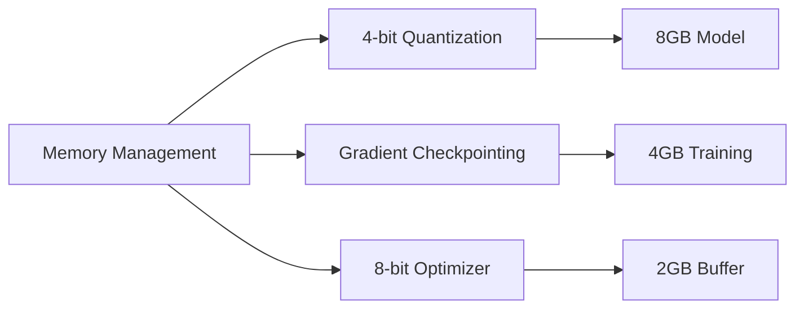
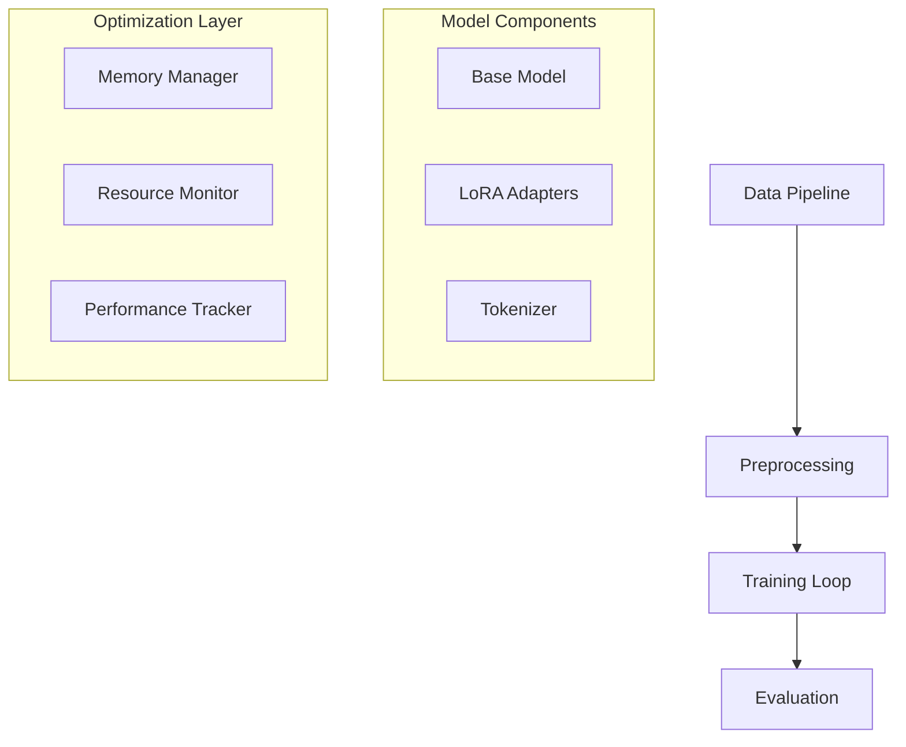
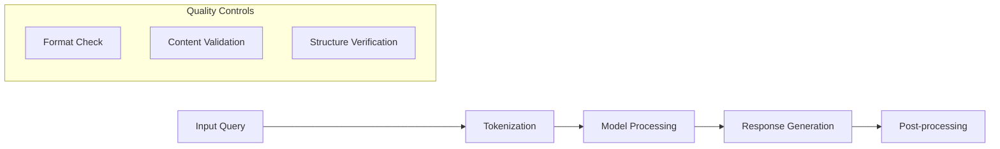

# Technical Architecture

## Model Configuration
### Base Model
- Model: Mistral-7B
- Quantization: 4-bit
- Sequence Length: 2048 tokens
- Memory Footprint: ~8GB

### LoRA Parameters
- Rank: 16
- Alpha: 32
- Target Modules:
  * Attention layers (q_proj, k_proj, v_proj, o_proj)
  * FFN layers (gate_proj, up_proj, down_proj)

## Memory Optimizations

## Training Infrastructure
### Hardware Requirements
- GPU: Tesla T4
- Memory: 16GB
- Framework: Unsloth
- Mixed Precision: Automatic
- Batch Processing: Dynamic

### Software Stack
- PyTorch with CUDA
- Transformers Library
- Unsloth Optimization
- WandB Monitoring

## Pipeline Architecture

## Implementation Details

### Model Initialization
- Load 4-bit quantized base model
- Apply LoRA configuration
- Setup gradient checkpointing
- Configure mixed precision training

### Training Process
- Batch size: 2 per device
- Gradient accumulation: 4 steps
- Learning rate: 2e-4
- Warmup ratio: 0.03
- Training epochs: 4

### Memory Management
1. Model Memory (8GB)
   - 4-bit quantized parameters
   - LoRA adapters
   - Model states

2. Training Memory (4GB)
   - Gradient accumulation
   - Optimizer states
   - Batch processing

3. Buffer Memory (2GB)
   - Forward pass computation
   - Backward pass computation
   - Temporary storage

## Response Generation

## Integration Points
1. WandB Monitoring
   - Training metrics
   - Resource usage
   - Quality assessment

2. Evaluation Framework
   - Response quality
   - Performance metrics
   - Resource efficiency

3. Deployment Pipeline
   - Model serving
   - Response generation
   - Quality monitoring
