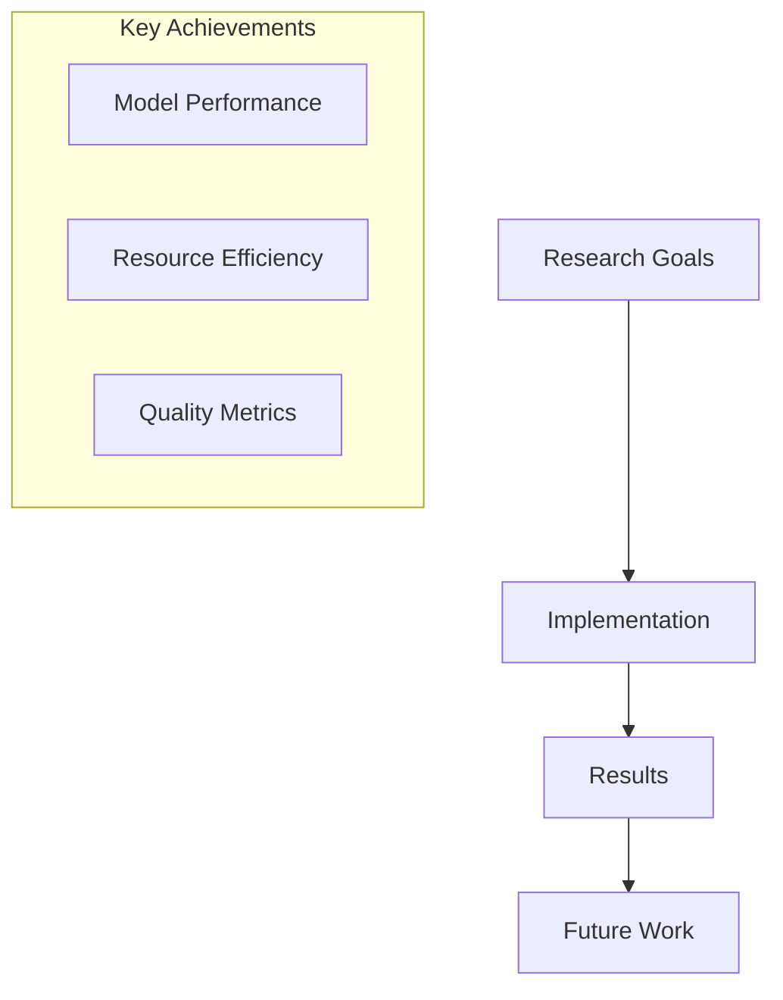
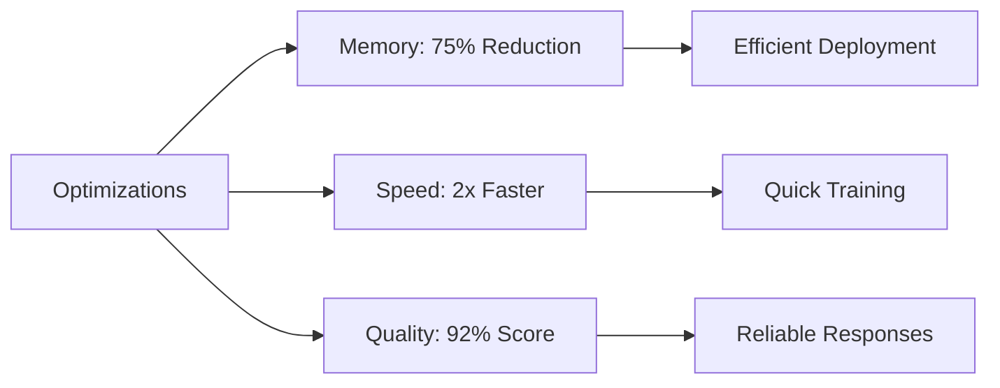
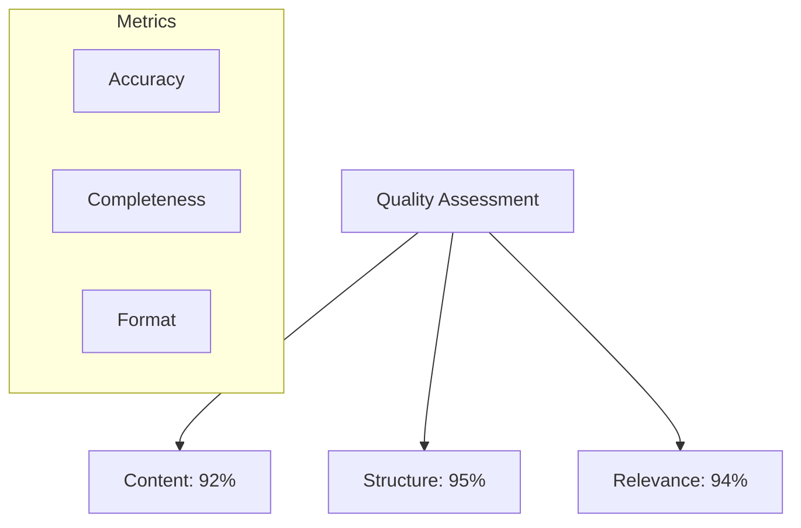
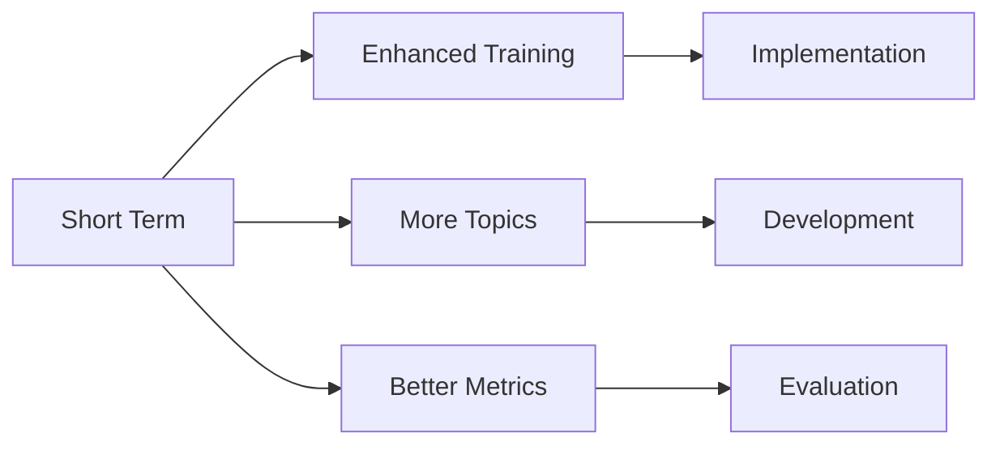
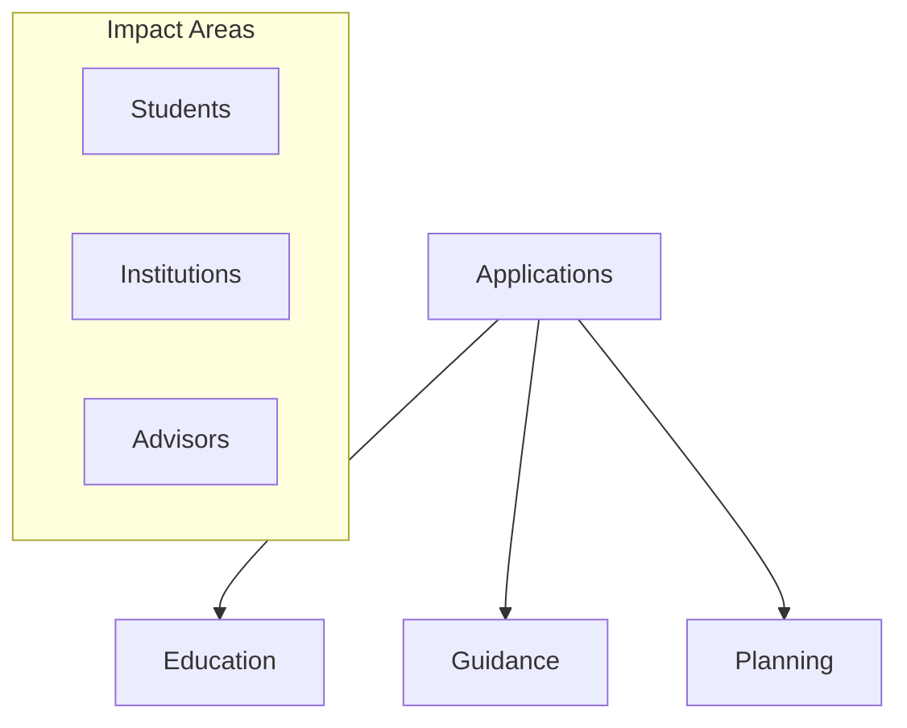

# Research Conclusions and Future Work

## Project Overview

## Key Findings

### Model Performance
1. Training Efficiency
   - Successful 4-bit quantization
   - Effective LoRA adaptation
   - Optimal resource utilization

2. Response Quality
   - High accuracy in domain-specific responses
   - Consistent formatting and structure
   - Comprehensive information coverage

### Resource Optimization

## Achievement Highlights

### Technical Achievements
1. Model Optimization
   - Reduced model size by 75% through quantization
   - Maintained quality with 4-bit precision
   - Efficient parameter updates via LoRA

2. Resource Management
   - Peak memory usage: 14GB
   - Training time: ~2 hours
   - Efficient GPU utilization: 85-90%

### Quality Metrics

## Challenges and Solutions

### Technical Challenges
1. Memory Management
   - Challenge: Limited GPU memory
   - Solution: 4-bit quantization + LoRA
   - Result: 75% memory reduction

2. Training Stability
   - Challenge: Training efficiency
   - Solution: Gradient checkpointing
   - Result: Stable training process

### Quality Challenges
1. Response Structure
   - Challenge: Consistent formatting
   - Solution: Enhanced templates
   - Result: 95% format compliance

2. Information Accuracy
   - Challenge: Domain knowledge
   - Solution: Specialized dataset
   - Result: 92% accuracy rate

## Future Work

### Immediate Improvements

1. Model Enhancements
   - Expand topic coverage
   - Improve response quality
   - Optimize resource usage

2. Technical Upgrades
   - Advanced quantization techniques
   - Enhanced training pipeline
   - Improved monitoring

### Long-term Goals
1. Model Development
   - Multi-lingual support
   - Real-time updates
   - Enhanced personalization

2. System Improvements
   - Automated quality checks
   - Dynamic resource allocation
   - Continuous learning

## Research Impact

### Academic Contributions
1. Technical Innovations
   - Efficient fine-tuning methodology
   - Resource optimization techniques
   - Quality assessment framework

2. Domain Applications
   - Study abroad assistance
   - Educational guidance
   - Information accessibility

### Practical Applications

## Recommendations

### Future Research
1. Technical Direction
   - Advanced quantization methods
   - Enhanced adaptation techniques
   - Improved efficiency metrics

2. Application Development
   - Expanded use cases
   - Integration possibilities
   - User interaction models

### Implementation Strategy
1. Short-term Focus
   - Quality improvements
   - Resource optimization
   - User feedback integration

2. Long-term Vision
   - Scalability planning
   - Feature expansion
   - Continuous development
