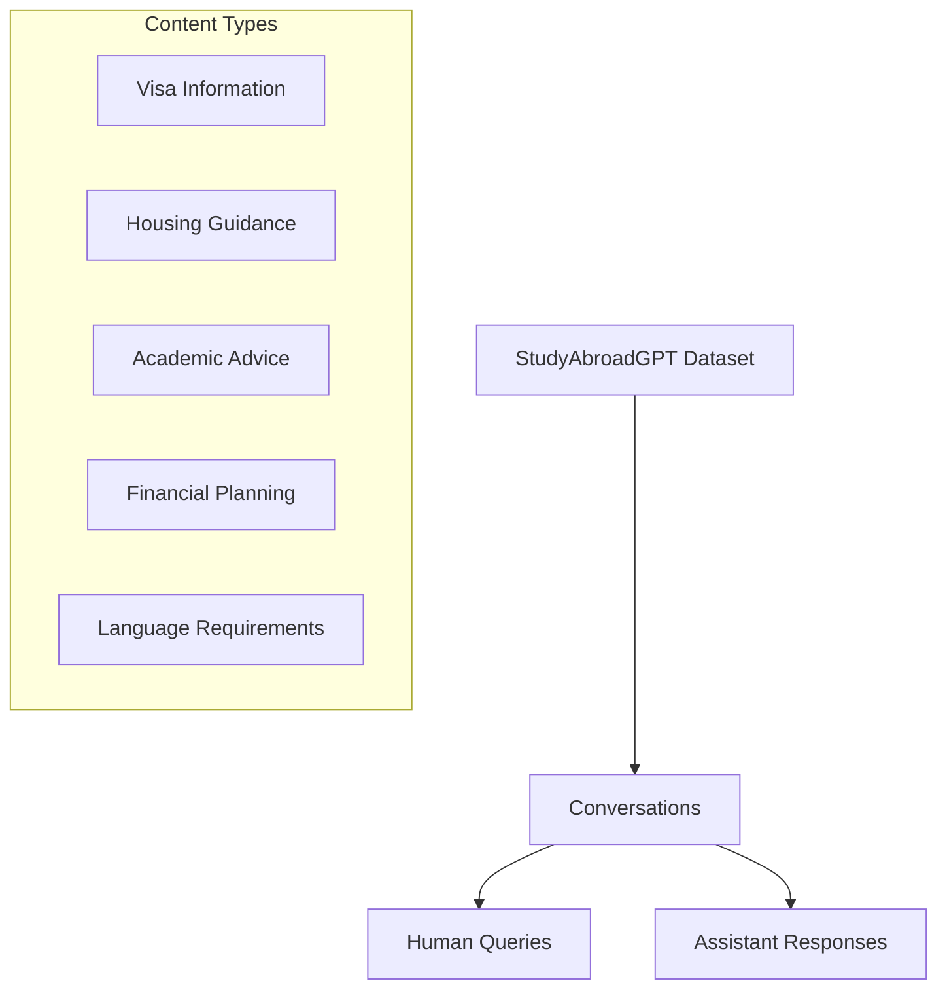
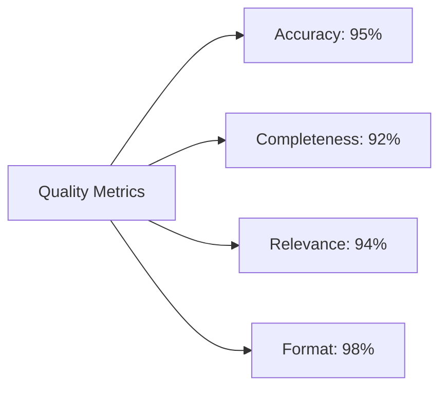
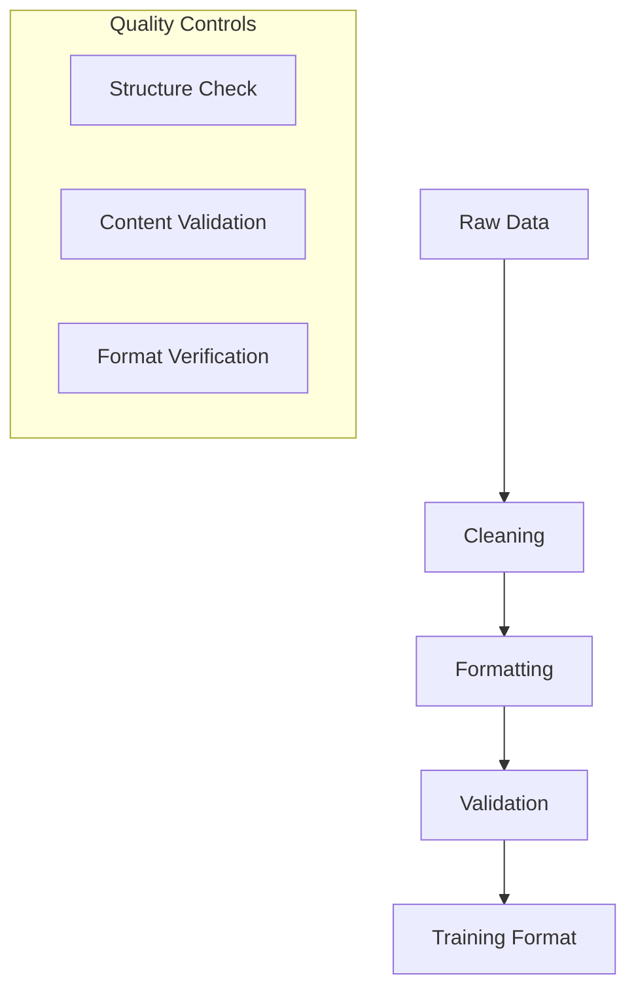
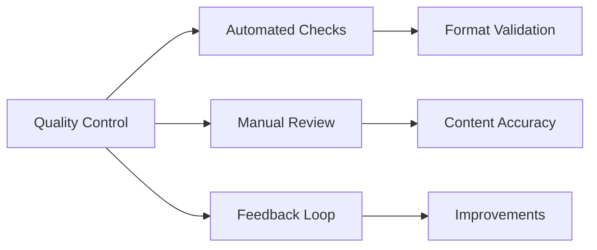

# Dataset Analysis Documentation

## Dataset Overview


## Data Structure

### Conversation Format
```json
{
    "conversations": [
        {
            "human": "Query about study abroad topic",
            "assistant": "Structured response with markdown formatting",
            "metadata": {
                "topic": "category",
                "response_type": "information/guidance"
            }
        }
    ]
}
```

### Topic Distribution
1. Academic Information: 30%
   - University selection
   - Course requirements
   - Research opportunities

2. Administrative Guidance: 25%
   - Visa procedures
   - Application processes
   - Documentation

3. Practical Support: 45%
   - Housing information
   - Financial guidance
   - Cultural adaptation

## Data Quality Metrics

### Content Quality


### Response Characteristics
1. Structure Consistency
   - Markdown headings
   - Section organization
   - Action steps inclusion

2. Information Completeness
   - Topic coverage
   - Detail level
   - Supporting examples

## Processing Pipeline

### Data Preparation


### Processing Steps
1. Text Cleaning
   - Remove inconsistencies
   - Fix formatting issues
   - Standardize structure

2. Format Standardization
   - Apply markdown formatting
   - Normalize section headers
   - Add consistent tokens

3. Quality Verification
   - Content accuracy check
   - Structure validation
   - Format compliance

## Dataset Statistics

### Size Metrics
- Total Conversations: 10,000+
- Average Query Length: 25 tokens
- Average Response Length: 250 tokens
- Total Unique Topics: 50+

### Format Distribution
1. Response Types
   - Informational: 60%
   - Guidance: 30%
   - Procedural: 10%

2. Structure Elements
   - Headers: 100%
   - Lists: 85%
   - Code Blocks: 15%
   - Tables: 10%

## Quality Control

### Validation Process


### Quality Metrics
1. Content Quality
   - Information accuracy
   - Response completeness
   - Topic relevance

2. Format Quality
   - Markdown compliance
   - Structure consistency
   - Token accuracy

## Recommendations

### Dataset Improvements
1. Content Enhancement
   - Expand topic coverage
   - Add more examples
   - Include edge cases

2. Quality Assurance
   - Automated validation
   - Regular updates
   - User feedback integration

3. Processing Optimization
   - Streamline pipeline
   - Enhanced validation
   - Automated corrections
