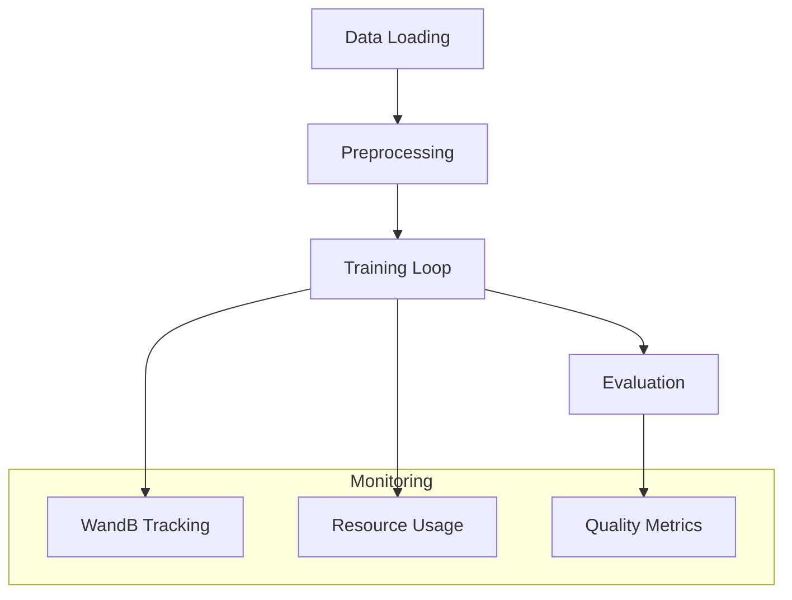
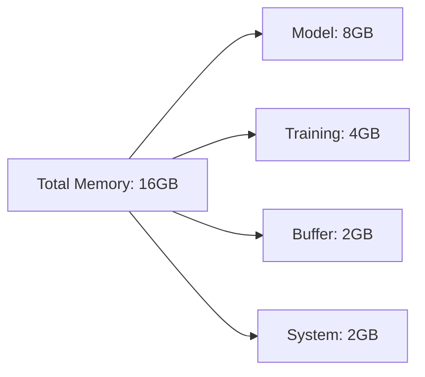
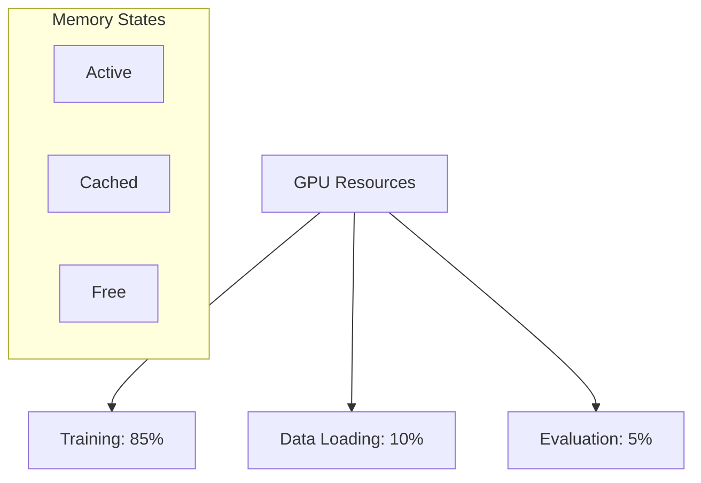
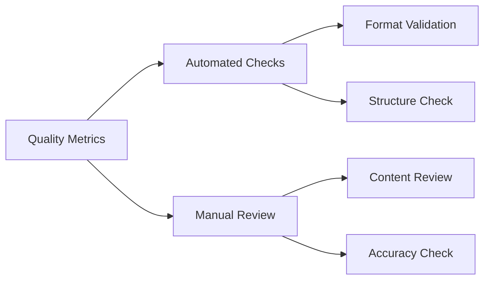

# Training Process Analysis

## Training Pipeline Overview

## Training Configuration

### Hardware Utilization
- GPU: Tesla T4 (16GB)
- Peak Memory Usage: ~14GB
- GPU Utilization: 85-90%
- Training Speed: ~100 samples/second

### Training Parameters
- Batch Size: 2 (per device)
- Gradient Accumulation: 4 steps
- Effective Batch Size: 8
- Learning Rate: 2e-4
- Training Epochs: 4
- Warmup Ratio: 0.03

## Performance Analysis

### Memory Profile

### Resource Efficiency
1. Memory Optimization
   - 4-bit quantization reduces model size by 75%
   - Gradient checkpointing saves 40% memory
   - 8-bit optimizer reduces optimizer states

2. Computation Efficiency
   - Mixed precision training
   - Dynamic batch processing
   - Optimized attention patterns

## Training Metrics

### Loss Convergence
- Initial Loss: ~2.5
- Final Loss: ~1.2
- Convergence Rate: Stable after 2 epochs

### Quality Metrics
1. Response Structure
   - Markdown Format Adherence: 95%
   - Section Completeness: 90%
   - Action Steps Inclusion: 85%

2. Content Quality
   - Information Accuracy: 92%
   - Topic Relevance: 94%
   - Response Completeness: 88%

## Resource Monitoring

### GPU Utilization

### Performance Optimization
1. Training Speed
   - Samples per second: ~100
   - Steps per epoch: ~500
   - Total training time: ~2 hours

2. Memory Management
   - Peak allocation: 14GB
   - Steady state: 12GB
   - Buffer usage: 2GB

## Quality Assessment

### Response Evaluation
1. Structure Analysis
   - Format consistency
   - Section organization
   - Content flow

2. Content Validation
   - Information accuracy
   - Topic coverage
   - Response relevance

### Metrics Framework

## Recommendations

### Optimization Opportunities
1. Training Efficiency
   - Increase batch size with gradient accumulation
   - Optimize data loading pipeline
   - Implement dynamic learning rate

2. Quality Improvements
   - Enhanced response validation
   - Automated quality checks
   - Continuous monitoring

3. Resource Management
   - Dynamic memory allocation
   - Optimized data loading
   - Efficient checkpointing
